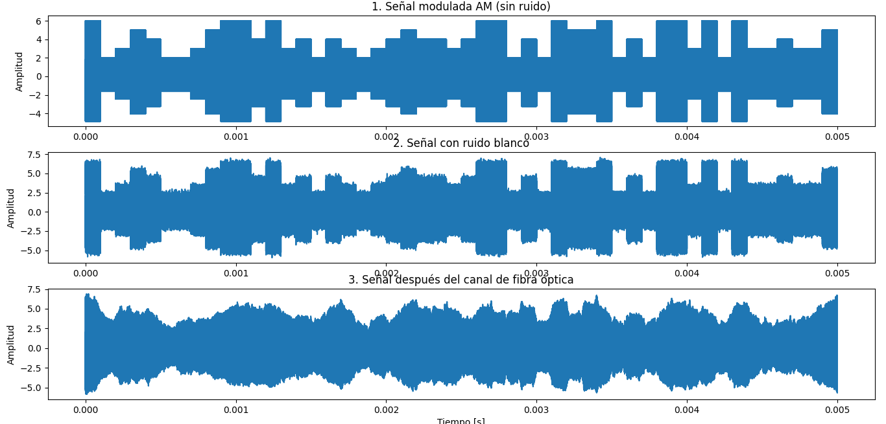
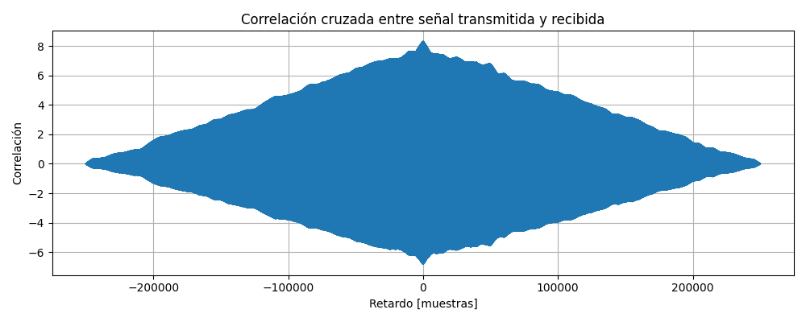
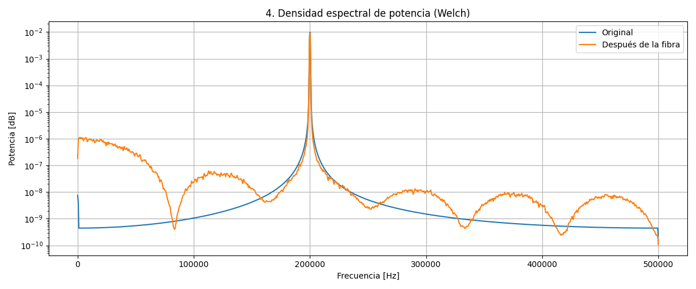
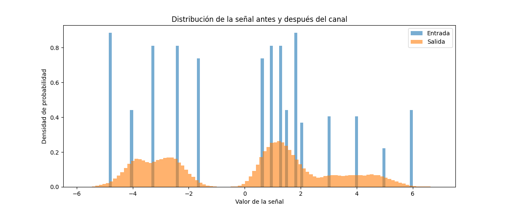
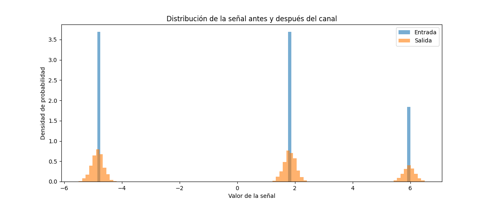
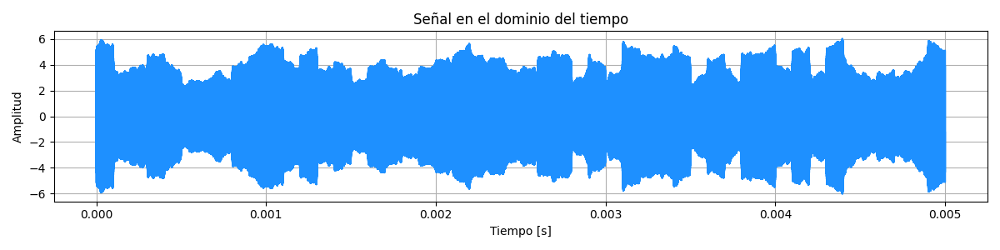

# Simulación de Ruido Blanco Gaussiano y Dispersión en Fibra Óptica

En este punto se simula un sistema de transmisión óptico donde se evalúa el impacto del **ruido blanco gaussiano** y la **dispersión cromática** sobre una señal digital modulada a partir de medidas estadisticas.

## Estructura del Proyecto

- `FibreSimu.py`: script principal que organiza la simulación, genera gráficas y estadísticas.
- `functions.py`: contiene las funciones de modulación, ruido, canal de fibra y filtros.
- `graphics.py`: se encarga de todas las gráficas necesarias para el análisis.

## Contexto

En una red metropolitana de fibra óptica que conecta universidades y centros de datos, se transmite información digital a 1 Gbps mediante modulación en cuadratura (QAM). Sin embargo, la dispersión cromática provoca que las señales de diferentes longitudes de onda viajen a velocidades ligeramente distintas, generando distorsión acumulativa en el receptor, esto se puede modelar como diferentes desplazamientos en fase de la señal. Además, el sistema se ve afectado por ruido térmico y de cuantización, modelado como ruido blanco gaussiano.

La empresa responsable de la red necesita evaluar el impacto de la dispersión sobre el ruido del sistema y proponer estrategias de mitigación, como el uso de filtros digitales adaptados o ecualizadores.

**_Modelo Matemático de la Dispersión Cromática:_**  
Para modelar la dispersión cromática en la fibra óptica, se utilizó una representación en el dominio de la frecuencia mediante una respuesta al impulso del canal dada por:

$$
H(f) = e^{-j \pi \beta_2 L f^2}
$$

**Donde:**

- \(H(f)\) es la respuesta en frecuencia del canal afectado por dispersión.  
- \(\beta_2\) es el parámetro de dispersión cromática de segundo orden (ps\(^2\)/km), característico del tipo de fibra utilizada.  
- \(L\) es la longitud total de la fibra óptica (en km).  
- \(f\) es la frecuencia relativa a la portadora (Hz).  

_Este modelo refleja cómo los diferentes componentes espectrales de la señal sufren un retardo de fase cuadrático con la frecuencia, generando un ensanchamiento temporal de los pulsos en el dominio del tiempo, y por tanto, una distorsión acumulativa en la señal recibida._


## Tareas Desarrolladas

1. **Generación de señal digital aleatoria** dentro de un rango de niveles determinado.
2. **Modulación QAM tipo AM**, donde la amplitud de la portadora varía según la señal digital.
3. **Inyección de ruido blanco gaussiano**, suavizado mediante convolución recursiva (ventana cuadrada).
4. **Simulación del canal de fibra óptica**, que incluye atenuación y dispersión cromática (β₂).
5. **Análisis de correlación cruzada** entre señal transmitida y recibida.
6. **Estimación espectral (PSD)** usando el método de Welch.
7. **Visualización de la densidad de probabilidad (PDF)** para ver la distorsión estadística.
8. **Aplicación de filtros de compensación**:
   - **Filtro de dispersión inversa**
   - **Filtro de frecuencia tipo pasa banda**

## Resultados y Análisis


*Figura 1. Cambios de la señal en el tiempo.*

- **Ensanchamiento temporal**: La dispersión genera un ensanchamiento temporal de los pulsos, lo cual produce solapamiento entre bits (interferencia intersimbólica). Figura 1.c
- **Ruido gaussiano**: Afecta principalmente la amplitud, generando una distribución más dispersa en la salida. Figura 1.b
- **Correlación cruzada**:  Se evidencia que la señal recibida ha perdido estructura debido al canal dispersivo por la forma ancha y difusa del patrón, sin un pico definido. Figura 2

*Figura 2. Correlación cruzada de la señal antes y despues de pasar por el modelo de canal.*


- **PSD**: Se observa un aumento de la banda ocupada por la señal tras pasar por la fibra, confirmando el efecto de dispersión. Figura 3

*Figura 3. Cambios en la Densidad Espectral de Potencia.*

- **PDF**: La señal de salida tiene mayor varianza y menor concentración alrededor de la media debido a la dispersión generada, esto se evidencia de mejor manera al enviar un único pulso, ya que muestra como cambia la probabilidad dejando de lado una distribucion unica en el pulso enviado y se esparce al rededor de el.

| Señal aleatoria (varios bits) | Pulso único |
|-------------------------------|-------------|
|  |  |

*Figura 4. Cambios en la Función de Densidad de Probabilidad.*
<br>
  *-Nota: En esta simulación, los niveles válidos van de 2 a 6. Las amplitudes que no pertenecen a estos niveles corresponden a la envolvente de la portadora y no son relevantes para el análisis.*


### Análisis Cuantitativo

```
Entrada -> media: -7.802867685313685e-15 varianza: 8.969999999999981  
Salida  -> media: 0.0018743888178939195 varianza: 8.429276934146086  
Coeficiente de correlación: 0.9567073434985564
```

- **Estadísticas de la señal**:
  - La **media** de la señal apenas cambia entre entrada y salida, lo que indica que el canal no introduce sesgo, aunque sí hay pequeñas variaciones.
  - La **varianza** se reduce ligeramente lo que refleja cierta atenuación del contenido energético tras pasar por la fibra.

- **Coeficiente de correlación**:
  - Se obtiene un valor cercano a 1 pero no 1, lo cual indica que, aunque la forma global de la señal se mantiene, existe cierta distorsión no despreciable provocada por la dispersión y el ruido del canal.


## Estrategias de Mitigación

Se implementan dos filtros digitales para recuperar la señal:

- **Filtro inverso de dispersión cromática**, basado en invertir la fase generada por el canal a partir de la funcion que representa el cambio en la fase en el canal.
- **Filtro de frecuencia pasa banda**, centrado en la frecuencia portadora con un ancho de banda ajustado.

Estos filtros ayudan a reducir el ensanchamiento y mejorar la correlación con la señal original. Figura 5

*Figura 5. Señal despues de filtrado.*

En la Figura 5 Se puede evidenciar como se intenta recuperar la forma del mensaje sin embargo aun no es lo suficientemente optimo, se necesitan metodos mas robustos que los filtros propuestos para poder recuperar el mensaje correctamente.
